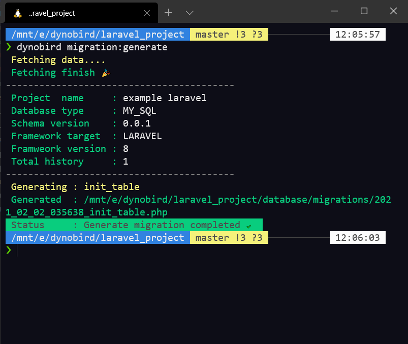

# Intorduction [beta-0.0.8]
Dynobird.com is database designer for web developer. So every line of code always think to make web developer easy in work. CLI tools is one of developer needs. We provide it with full support for community.
# Install
[dynobird](https://dynobird.com) cli must install under nodeJS and npm. If you dont have npm and nodeJS follow this tutorial https://nodejs.org/en/download/

[dynobird](https://dynobird.com) recommend to use nodeJS version 14.04

```shell
npm i -g dynobird
```
# Using
[dynobird](https://dynobird.com) CLI is build on top of nodeJS. NodeJS required to install in Operating system. 
[dynobird](https://dynobird.com) CLI required token to access your project. Follow this picture for copy your project token.


## dynobird.json
this is configuration for project information and token for generating migration. This file can generate with command ```dynobird init```
```json
{
        "entitiesDir": "app/Models",
        "migrationsDir": "database/migrations",
        "token": "6ebb251fe2e307536de653468098a2d8a87d1026e8c3800731d961317405954e3364c555c8a59cd4410ad19d132d045354e5",
        "tag": "tag"
}
```

## init
```$ dynobird init``` is command for initial dynobird.json if empty in project.


## migration
```$ dynobird migration:generate``` is command for generate database design to database migration.

<!--  -->

